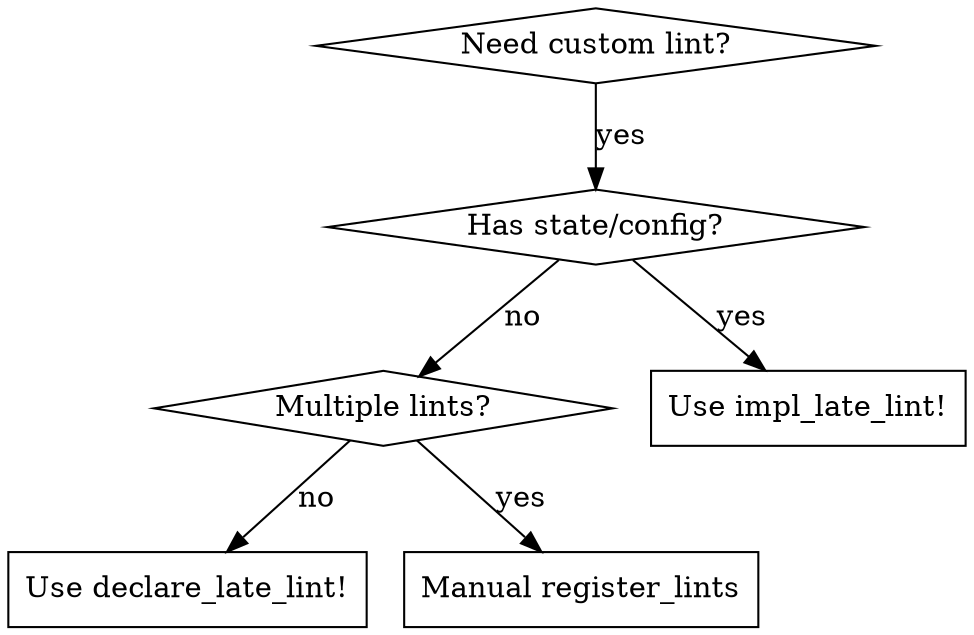

# Writing Rust Lints with Dylint

Create custom Rust lints that run as dynamic libraries via Dylint.

## When to Use

- Creating project-specific lints for code patterns
- Enforcing team conventions that Clippy doesn't cover
- Building reusable lint libraries
- Any task involving `LateLintPass`, `EarlyLintPass`, or rustc internals

## Quick Start

```sh
cargo dylint new my_lint_name
cd my_lint_name
# Edit src/lib.rs, ui/main.rs
cargo build && cargo test
```

## Macro Selection



- **`declare_late_lint!`**: Single lint, no state. Generates everything.
- **`impl_late_lint!`**: Single lint WITH state/config. Pass initializer.
- **Manual `register_lints`**: Multiple lints in one library. Use `dylint_library!()`.

**NEVER mix**: If using `declare_late_lint!`, do NOT manually write `dylint_library!()` or `register_lints`.

## EarlyLintPass (AST-level)

For lints that don't need type information (AST-only):

```rust
#![feature(rustc_private)]

extern crate rustc_ast;
extern crate rustc_lint;
extern crate rustc_session;

use rustc_ast::ast::{Expr, ExprKind};
use rustc_lint::{EarlyContext, EarlyLintPass, LintContext};
use rustc_session::{declare_lint, declare_lint_pass};

declare_lint! {
    pub MY_EARLY_LINT,
    Warn,
    "description"
}

declare_lint_pass!(MyEarlyLint => [MY_EARLY_LINT]);

impl EarlyLintPass for MyEarlyLint {
    fn check_expr(&mut self, cx: &EarlyContext<'_>, expr: &Expr) {
        // AST-level checks - NO type info available
        if let ExprKind::MethodCall(method_call) = &expr.kind {
            if method_call.seg.ident.name.as_str() == "unwrap" {
                cx.lint(MY_EARLY_LINT, |diag| {
                    diag.primary_message("found unwrap");
                });
            }
        }
    }
}

// IMPORTANT: Still need this for Dylint
dylint_linting::dylint_library!();
```

**Key differences from LateLintPass:**
- Use `rustc_session::declare_lint!` + `declare_lint_pass!` (NOT dylint macros)
- Use `EarlyContext` instead of `LateContext`
- No `cx.typeck_results()` - types not available
- AST types from `rustc_ast` (not `rustc_hir`)
- Still need `dylint_linting::dylint_library!()` at end

## Project Structure

```
my_lint/
├── .cargo/config.toml    # Linker config
├── Cargo.toml
├── src/lib.rs            # Lint implementation
├── ui/                   # MUST be named "ui" (not "ui_tests")
│   ├── main.rs           # Test code
│   └── main.stderr       # Expected output (trailing newline!)
```

## Cargo.toml

```toml
[package]
name = "my_lint"
version = "0.1.0"
edition = "2024"
publish = false

[lib]
crate-type = ["cdylib"]

[dependencies]
clippy_utils = { git = "https://github.com/rust-lang/rust-clippy", rev = "CURRENT_REV" }
dylint_linting = "5.0.0"

[dev-dependencies]
dylint_testing = "5.0.0"

[package.metadata.rust-analyzer]
rustc_private = true
```

## .cargo/config.toml

```toml
[target.x86_64-unknown-linux-gnu]
linker = "dylint-link"

[target.x86_64-apple-darwin]
linker = "dylint-link"

[target.aarch64-apple-darwin]
linker = "dylint-link"
```

## Simple Lint Template

```rust
#![feature(rustc_private)]
#![warn(unused_extern_crates)]

extern crate rustc_hir;
extern crate rustc_lint;
extern crate rustc_span;

use clippy_utils::diagnostics::span_lint_and_help;
use rustc_hir::{Expr, ExprKind};
use rustc_lint::{LateContext, LateLintPass};

dylint_linting::declare_late_lint! {
    /// ### What it does
    /// Describe what the lint detects.
    ///
    /// ### Why is this bad?
    /// Explain the problem.
    ///
    /// ### Example
    /// ```rust
    /// // Bad
    /// ```
    ///
    /// Use instead:
    /// ```rust
    /// // Good
    /// ```
    pub MY_LINT_NAME,
    Warn,
    "brief description"
}

impl<'tcx> LateLintPass<'tcx> for MyLintName {
    fn check_expr(&mut self, cx: &LateContext<'tcx>, expr: &'tcx Expr<'tcx>) {
        // Implementation
    }
}

#[test]
fn ui() {
    dylint_testing::ui_test(env!("CARGO_PKG_NAME"), "ui");
}
```

## Configurable Lint Template

```rust
#![feature(rustc_private)]
#![warn(unused_extern_crates)]

extern crate rustc_hir;
extern crate rustc_lint;
extern crate rustc_span;

use clippy_utils::diagnostics::span_lint_and_help;
use rustc_hir::{Expr, ExprKind};
use rustc_lint::{LateContext, LateLintPass};
use serde::Deserialize;

dylint_linting::impl_late_lint! {
    /// Documentation...
    pub MY_LINT_NAME,
    Warn,
    "brief description",
    MyLintName::new()
}

#[derive(Default, Deserialize)]
struct Config {
    option_name: Option<u64>,
}

struct MyLintName {
    config: Config,
}

impl MyLintName {
    pub fn new() -> Self {
        Self {
            config: dylint_linting::config_or_default(env!("CARGO_PKG_NAME")),
        }
    }
}

impl<'tcx> LateLintPass<'tcx> for MyLintName {
    fn check_expr(&mut self, cx: &LateContext<'tcx>, expr: &'tcx Expr<'tcx>) {
        let limit = self.config.option_name.unwrap_or(100);
        // Use limit...
    }
}
```

Config in `dylint.toml` (workspace root):
```toml
[my_lint_name]
option_name = 200
```

## LateLintPass Signatures

**CRITICAL**: These exact signatures. The API is unstable - don't guess.

```rust
impl<'tcx> LateLintPass<'tcx> for MyLint {
    fn check_expr(&mut self, cx: &LateContext<'tcx>, expr: &'tcx Expr<'tcx>) {}

    fn check_fn(
        &mut self,
        cx: &LateContext<'tcx>,
        kind: FnKind<'tcx>,
        decl: &'tcx FnDecl<'_>,
        body: &'tcx Body<'_>,
        span: Span,
        local_def_id: LocalDefId,  // NOT HirId!
    ) {}

    fn check_item(&mut self, cx: &LateContext<'tcx>, item: &'tcx Item<'tcx>) {}
    fn check_stmt(&mut self, cx: &LateContext<'tcx>, stmt: &'tcx Stmt<'tcx>) {}
    fn check_block(&mut self, cx: &LateContext<'tcx>, block: &'tcx Block<'tcx>) {}
    fn check_pat(&mut self, cx: &LateContext<'tcx>, pat: &'tcx Pat<'tcx>) {}
    fn check_local(&mut self, cx: &LateContext<'tcx>, local: &'tcx LetStmt<'tcx>) {}
    fn check_arm(&mut self, cx: &LateContext<'tcx>, arm: &'tcx Arm<'tcx>) {}
}
```

Import for `check_fn`:
```rust
use rustc_hir::{intravisit::FnKind, Body, FnDecl};
use rustc_hir::def_id::LocalDefId;
```

## Type Checking

**WRONG** (string matching):
```rust
// DON'T DO THIS
let ty_str = format!("{adt_def:?}");
if ty_str.contains("Option") { ... }
```

**RIGHT** (diagnostic items):
```rust
use rustc_span::sym;

let ty = cx.typeck_results().expr_ty(expr);
if let ty::Adt(adt, _) = ty.kind() {
    // Option
    if cx.tcx.is_diagnostic_item(sym::Option, adt.did()) { ... }
    // Result
    if cx.tcx.is_diagnostic_item(sym::Result, adt.did()) { ... }
    // Vec
    if cx.tcx.is_diagnostic_item(sym::Vec, adt.did()) { ... }
}
```

## Enum Variant Inspection

For linting match patterns and enum usage:

```rust
use rustc_middle::ty;

fn check_expr(&mut self, cx: &LateContext<'tcx>, expr: &'tcx Expr<'tcx>) {
    if let ExprKind::Match(scrutinee, arms, _) = expr.kind {
        let ty = cx.typeck_results().expr_ty(scrutinee);

        if let ty::Adt(adt, _) = ty.kind() {
            // Check if it's an enum (not struct/union)
            if !adt.is_enum() {
                return;
            }

            // Get all variants
            let variants = adt.variants();

            // Iterate with indices
            for (idx, variant) in variants.iter_enumerated() {
                let variant_name = variant.name;
                let variant_def_id = variant.def_id;
            }
        }
    }
}
```

**Resolving Matched Variants:**

```rust
use rustc_hir::def::Res;

fn get_matched_variant(cx: &LateContext, pat: &Pat) -> Option<usize> {
    if let PatKind::TupleStruct(qpath, _, _) | PatKind::Struct(qpath, _, _) = &pat.kind {
        let res = cx.qpath_res(qpath, pat.hir_id);
        if let Res::Def(_, def_id) = res {
            // Match against variant def_ids
        }
    }
    None
}
```

## Path Matching

**For function calls**:
```rust
use clippy_utils::{paths::PathLookup, value_path};

static STD_ENV_VAR: PathLookup = value_path!(std::env::var);

fn check_expr(&mut self, cx: &LateContext<'tcx>, expr: &'tcx Expr<'tcx>) {
    if let ExprKind::Call(callee, args) = expr.kind {
        if STD_ENV_VAR.matches_path(cx, callee) {
            // It's std::env::var
        }
    }
}
```

**For method calls**:
```rust
if let ExprKind::MethodCall(path, receiver, args, span) = expr.kind {
    if path.ident.name == sym::unwrap {
        // Check receiver type
        let ty = cx.typeck_results().expr_ty(receiver);
        // ...
    }
}
```

## Diagnostic Functions

```rust
use clippy_utils::diagnostics::{span_lint, span_lint_and_help, span_lint_and_sugg};
use rustc_errors::Applicability;

// Simple warning
span_lint(cx, MY_LINT, span, "message");

// With help text
span_lint_and_help(
    cx, MY_LINT, span,
    "problem message",
    None,  // or Some(help_span)
    "suggestion text",
);

// With code suggestion
span_lint_and_sugg(
    cx, MY_LINT, span,
    "problem message",
    "try",
    "replacement_code".to_string(),
    Applicability::MachineApplicable,
);
```

## Test Structure

`ui/main.rs`:
```rust
fn should_warn() {
    problematic_code();  // Should trigger lint
}

fn should_not_warn() {
    acceptable_code();   // Should NOT trigger lint
}

fn main() {}
```

`ui/main.stderr`:
```
warning: lint message here
  --> $DIR/main.rs:2:5
   |
LL |     problematic_code();
   |     ^^^^^^^^^^^^^^^^^^
   |
   = note: `#[warn(my_lint_name)]` on by default

warning: 1 warning emitted

```

**IMPORTANT**: Include trailing blank line in `.stderr`.

## Common Mistakes

| Mistake | Fix |
|---------|-----|
| Using `HirId` in `check_fn` | Use `LocalDefId` |
| String formatting for types | Use diagnostic items |
| Manual `register_lints` with `declare_late_lint!` | Pick one pattern |
| Test dir named `ui_tests/` | Must be `ui/` |
| Missing trailing newline in `.stderr` | Add blank line at end |
| Inventing config parsing | Use `dylint_linting::config_or_default()` |
| Wrong clippy_utils rev | Match rust-toolchain |
| Manual Copy/Clone checks | Use `implements_trait()` with lang items |
| Guessing async detection | Use `header.is_async()` from FnKind |
| Walking body manually | Use custom `Visitor` trait impl |
| Wrong MIR access | Use `cx.tcx.optimized_mir(def_id.to_def_id())` |
| Wrong snippet for suggestions | Use receiver span, not whole expr span |
| Crate-level attr detection | Use `check_crate` + `cx.tcx.hir().krate_attrs()` |
| Parsing attr arguments | Use `attr.meta()` + `MetaItemKind::List` |
| Generic bounds checking | Use `generics.bounds_for_param()` |
| Closure capture analysis | Use `cx.typeck_results().closure_min_captures_flattened()` |
| EarlyLintPass with `declare_late_lint!` | Use `rustc_session::declare_lint!` + `declare_lint_pass!` |
| EarlyLintPass without `dylint_library!()` | Still need `dylint_linting::dylint_library!()` at end |
| Using `cx.typeck_results()` in EarlyLintPass | Types not available in EarlyLintPass |

## Skip Macro-Generated Code

```rust
fn check_expr(&mut self, cx: &LateContext<'tcx>, expr: &'tcx Expr<'tcx>) {
    if expr.span.from_expansion() {
        return;
    }
    // ...
}
```

## Check If Public

```rust
fn check_fn(
    &mut self,
    cx: &LateContext<'tcx>,
    _kind: FnKind<'tcx>,
    _decl: &'tcx FnDecl<'_>,
    _body: &'tcx Body<'_>,
    _span: Span,
    local_def_id: LocalDefId,
) {
    if !cx.effective_visibilities.is_exported(local_def_id) {
        return;  // Skip private functions
    }
}
```

## Detect Async Functions

```rust
use rustc_hir::intravisit::FnKind;

fn check_fn(
    &mut self,
    cx: &LateContext<'tcx>,
    kind: FnKind<'tcx>,
    _decl: &'tcx FnDecl<'_>,
    body: &'tcx Body<'_>,
    _span: Span,
    _local_def_id: LocalDefId,
) {
    let is_async = match kind {
        FnKind::ItemFn(_, _, header) => header.is_async(),
        FnKind::Method(_, sig) => sig.header.is_async(),
        FnKind::Closure => false,
    };

    if is_async {
        // Check async-specific patterns in body
    }
}
```

## Check Trait Implementation

```rust
use clippy_utils::ty::implements_trait;

fn check_expr(&mut self, cx: &LateContext<'tcx>, expr: &'tcx Expr<'tcx>) {
    let ty = cx.typeck_results().expr_ty(expr);

    // Check Copy trait
    if let Some(copy_trait) = cx.tcx.lang_items().copy_trait() {
        if implements_trait(cx, ty, copy_trait, &[]) {
            // Type implements Copy
        }
    }

    // Check Clone trait
    if let Some(clone_trait) = cx.tcx.lang_items().clone_trait() {
        if implements_trait(cx, ty, clone_trait, &[]) {
            // Type implements Clone
        }
    }

    // Check Iterator trait
    if let Some(iterator_trait) = cx.tcx.get_diagnostic_item(sym::Iterator) {
        if implements_trait(cx, ty, iterator_trait, &[]) {
            // Type implements Iterator
        }
    }
}
```

## Custom HIR Visitor

For complex analysis that walks the entire function body:

```rust
use rustc_hir::intravisit::{self, Visitor};

struct MyVisitor<'a, 'tcx> {
    cx: &'a LateContext<'tcx>,
    found_pattern: bool,
}

impl<'a, 'tcx> Visitor<'tcx> for MyVisitor<'a, 'tcx> {
    fn visit_expr(&mut self, expr: &'tcx Expr<'tcx>) {
        // Check for pattern
        if let ExprKind::Call(callee, args) = expr.kind {
            self.found_pattern = true;
        }

        // Continue walking children
        intravisit::walk_expr(self, expr);
    }
}

// In check_fn:
fn check_fn(&mut self, cx: &LateContext<'tcx>, ..., body: &'tcx Body<'_>, ...) {
    let mut visitor = MyVisitor { cx, found_pattern: false };
    visitor.visit_body(body);

    if visitor.found_pattern {
        // Emit lint
    }
}
```

## MIR Analysis (Advanced)

For complex data-flow analysis, use MIR instead of HIR:

```rust
extern crate rustc_middle;

use rustc_middle::mir::{Body, BasicBlock, StatementKind, TerminatorKind};

fn check_fn(
    &mut self,
    cx: &LateContext<'tcx>,
    _kind: FnKind<'tcx>,
    _decl: &'tcx FnDecl<'_>,
    _body: &'tcx Body<'_>,
    _span: Span,
    local_def_id: LocalDefId,
) {
    // Get MIR for this function
    let mir: &Body<'tcx> = cx.tcx.optimized_mir(local_def_id.to_def_id());

    // Iterate basic blocks
    for (bb_idx, bb_data) in mir.basic_blocks.iter_enumerated() {
        // Check statements
        for stmt in &bb_data.statements {
            if let StatementKind::Assign(box (place, rvalue)) = &stmt.kind {
                // Analyze assignments
            }
        }

        // Check terminator
        if let Some(term) = &bb_data.terminator {
            match &term.kind {
                TerminatorKind::Call { func, args, .. } => { /* function call */ }
                TerminatorKind::Return => { /* return */ }
                _ => {}
            }
        }
    }
}
```

## Source Snippets for Suggestions

When generating fix suggestions, extract receiver from method calls:

```rust
use clippy_utils::source::snippet;

fn check_expr(&mut self, cx: &LateContext<'tcx>, expr: &'tcx Expr<'tcx>) {
    // Detect: expr.len() == 0
    if let ExprKind::Binary(op, left, right) = expr.kind
        && op.node == BinOpKind::Eq
        && let ExprKind::MethodCall(method, receiver, _, _) = left.kind
        && method.ident.name.as_str() == "len"
        && is_zero(right)
    {
        // Get the RECEIVER's source code, not the whole .len() call
        let receiver_snippet = snippet(cx, receiver.span, "..");

        span_lint_and_sugg(
            cx,
            MY_LINT,
            expr.span,  // Span of whole `x.len() == 0`
            "use `.is_empty()` instead",
            "try",
            format!("{}.is_empty()", receiver_snippet),  // x.is_empty()
            Applicability::MachineApplicable,
        );
    }
}
```

**Key**: For `.len()` → `.is_empty()`, use `receiver.span`, not `left.span`.

## Check Attributes

For linting `#[...]` and `#![...]` attributes:

```rust
use rustc_hir::Attribute;
use rustc_ast::AttrStyle;

impl<'tcx> LateLintPass<'tcx> for MyLint {
    fn check_attribute(&mut self, cx: &LateContext<'tcx>, attr: &'tcx Attribute) {
        // Check attribute name
        if attr.has_name(sym::allow) {
            // Distinguish crate-level #![...] from item-level #[...]
            if attr.style == AttrStyle::Inner {
                // This is #![...] (inner attribute, could be crate-level)
            } else {
                // This is #[...] (outer attribute, item-level)
            }
        }
    }
}
```

**Crate-level vs Module-level Inner Attributes:**

Inner attributes (`#![...]`) can appear at crate root OR inside modules. To check specifically for crate-level:

```rust
fn check_crate(&mut self, cx: &LateContext<'tcx>) {
    // Get crate-level attributes
    for attr in cx.tcx.hir().krate_attrs() {
        if attr.has_name(sym::allow) {
            span_lint(cx, MY_LINT, attr.span(), "crate-level allow is too broad");
        }
    }
}
```

**Extract Attribute Arguments:**

```rust
use rustc_ast::{MetaItemKind, NestedMetaItem};

fn check_attribute(&mut self, cx: &LateContext<'tcx>, attr: &'tcx Attribute) {
    if attr.has_name(sym::allow) {
        // Get the meta item (parsed attribute)
        if let Some(meta) = attr.meta() {
            if let MetaItemKind::List(items) = meta.kind {
                for item in items {
                    if let NestedMetaItem::MetaItem(mi) = item {
                        // mi.path gives the lint name path
                        let lint_name = mi.path.segments.iter()
                            .map(|s| s.ident.to_string())
                            .collect::<Vec<_>>()
                            .join("::");
                    }
                }
            }
        }
    }
}
```

## Check Generic Bounds

For linting generic type parameters and their bounds:

```rust
use rustc_hir::{Generics, GenericBound, GenericParam, GenericParamKind};

impl<'tcx> LateLintPass<'tcx> for MyLint {
    fn check_generics(&mut self, cx: &LateContext<'tcx>, generics: &'tcx Generics<'tcx>) {
        for param in generics.params {
            // Check if this is a type parameter (T, U, etc.)
            if let GenericParamKind::Type { .. } = param.kind {
                let has_debug = generics.bounds_for_param(param.def_id).any(|bound| {
                    bound.bounds.iter().any(|b| {
                        if let GenericBound::Trait(poly_trait_ref, _) = b {
                            // Check if bound is Debug
                            let trait_def_id = poly_trait_ref.trait_ref.trait_def_id();
                            if let Some(debug_trait) = cx.tcx.get_diagnostic_item(sym::Debug) {
                                return trait_def_id == Some(debug_trait);
                            }
                        }
                        false
                    })
                });

                if !has_debug {
                    span_lint(
                        cx,
                        MY_LINT,
                        param.span,
                        format!("type parameter `{}` should have Debug bound", param.name.ident()),
                    );
                }
            }
        }
    }
}
```

## Check Closure Captures

For analyzing what closures capture:

```rust
use rustc_middle::ty::{self, UpvarCapture};

fn check_expr(&mut self, cx: &LateContext<'tcx>, expr: &'tcx Expr<'tcx>) {
    if let ExprKind::Closure(closure) = expr.kind {
        let def_id = closure.def_id;

        // Get closure captures
        let captures = cx.typeck_results().closure_min_captures_flattened(def_id);

        for capture in captures {
            let place = &capture.place;
            let capture_kind = capture.info.capture_kind;

            match capture_kind {
                UpvarCapture::ByValue => {
                    // Closure moves this variable
                }
                UpvarCapture::ByRef(borrow_kind) => {
                    use rustc_middle::mir::BorrowKind;
                    match borrow_kind {
                        BorrowKind::Immutable => { /* &T */ }
                        BorrowKind::Mutable { .. } => {
                            // Closure captures &mut T - potential issue
                            span_lint(
                                cx,
                                MY_LINT,
                                expr.span,
                                "closure captures mutable reference",
                            );
                        }
                        BorrowKind::Unique => { /* unique borrow */ }
                    }
                }
            }
        }
    }
}
```

## Reference Files

For detailed API documentation, see the reference files in this skill directory:
- `dylint-reference.md` - Complete Dylint usage guide
- `rustc-internals-reference.md` - HIR, types, spans
- `clippy-utils-reference.md` - Helper functions
- `example-lints.md` - Real-world examples
